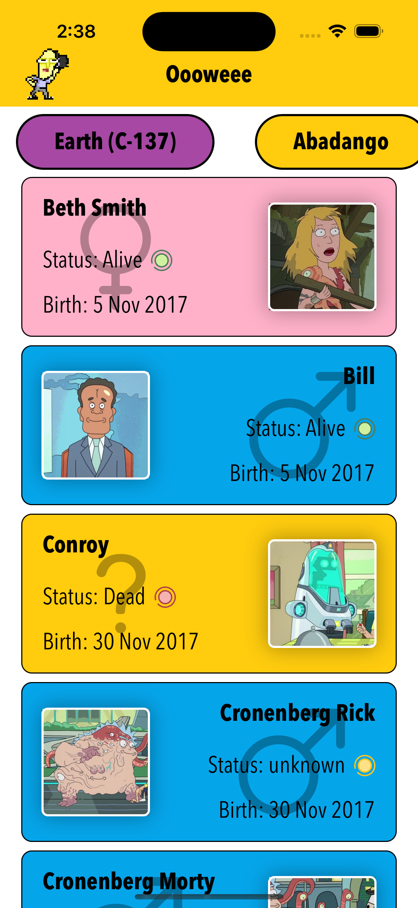
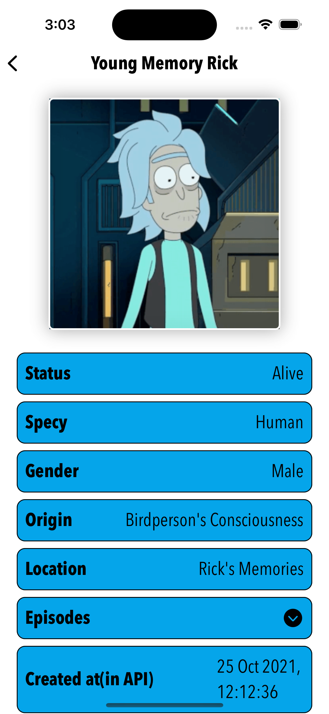

# Oooweee
SwiftUI app with rick and morty api

## home screen

## character detail 

## character detail 

## if there is no character in a location

## splash screen 

## short preview 

## getting all locations

